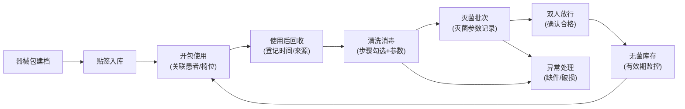
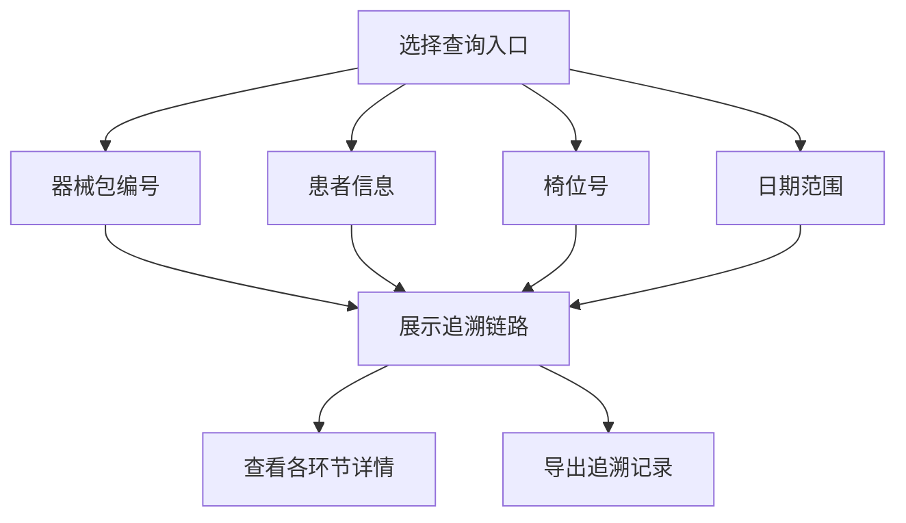

## 1. 产品概述

口腔门诊器械追溯管理系统，面向单体口腔门诊护士长和器械护士，将"器械从使用后回收到再次上台前"的每一步串成完整可核查链路。在忙碌接诊中快速留下完整记录，遇到患者投诉、院感抽查或内部复盘时，能按器械包、患者、椅位、日期四个入口迅速查清去向与责任环节。

## 2. 核心功能

### 2.1 用户角色

| 角色 | 注册方式 | 核心权限 |
|------|----------|----------|
| 护士长 | 系统预置 | 全功能权限、双人放行确认、异常处理审批 |
| 器械护士 | 系统预置 | 日常登记操作、清洗消毒记录、灭菌登记 |

### 2.2 功能模块

1. **器械包台账**：器械包建档、条码管理、有效期管理、状态总览
2. **清洗消毒登记**：回收登记、清洗步骤勾选、关键参数录入、批次关联
3. **灭菌放行**：灭菌批次管理、灭菌参数记录、双人放行确认
4. **异常处理**：缺件破损上报、异常批次追溯、处理记录
5. **库存与借还**：库存总览、借还登记、临期预警、有效期提醒
6. **追溯查询**：按器械包/患者/椅位/日期四维追溯

### 2.3 页面详情

| 页面名称 | 模块名称 | 功能描述 |
|----------|----------|----------|
| 器械包台账 | 器械包列表 | 展示所有器械包，支持按名称/编号/状态筛选 |
| 器械包台账 | 新增/编辑器械包 | 器械包名称、编号、类型、器械清单、条码生成 |
| 器械包台账 | 状态卡片 | 在用、清洗中、灭菌中、已灭菌、异常等状态统计 |
| 清洗消毒登记 | 回收登记 | 扫码/选择器械包、记录回收时间、关联患者/椅位 |
| 清洗消毒登记 | 清洗步骤 | 多步骤勾选（初洗、酶洗、漂洗、终末漂洗、消毒、干燥） |
| 清洗消毒登记 | 参数录入 | 清洗温度、时间、酶液浓度等关键参数 |
| 灭菌放行 | 灭菌批次 | 创建灭菌批次、关联器械包、记录灭菌参数 |
| 灭菌放行 | 放行确认 | 双人确认放行、记录放行时间和人员 |
| 灭菌放行 | 有效期管理 | 自动计算无菌有效期、临期提醒 |
| 异常处理 | 异常上报 | 缺件/破损/不合格记录、照片上传、描述 |
| 异常处理 | 异常处理 | 处理措施、处理结果、责任人记录 |
| 异常处理 | 批次追溯 | 异常批次一键追溯相关器械包 |
| 库存与借还 | 库存总览 | 已灭菌器械包库存、有效期排序、临期预警 |
| 库存与借还 | 借还登记 | 借出/归还登记、借用人、用途、时间 |
| 库存与借还 | 开包使用 | 开包使用反登记、关联患者/椅位/医生 |
| 追溯查询 | 四维查询 | 按器械包/患者/椅位/日期四个入口查询 |
| 追溯查询 | 链路展示 | 完整追溯链路可视化展示、各环节时间节点 |
| 追溯查询 | 详情查看 | 每个环节的详细记录、操作人、参数 |

## 3. 核心流程

### 3.1 器械全生命周期流程

### 3.2 追溯查询流程

## 4. 用户界面设计

### 4.1 设计风格

**设计理念**：医疗专业感 + 高效操作体验

- **主色调**：医疗蓝 `#0E7490`（青色系，传递专业、洁净、可信赖感）
- **辅助色**：成功绿 `#059669`、警示橙 `#D97706`、危险红 `#DC2626`
- **中性色**：深灰 `#1F2937`、中灰 `#6B7280`、浅灰 `#F3F4F6`、纯白 `#FFFFFF`
- **按钮风格**：圆角 8px，主要按钮实色填充，次要按钮描边样式
- **字体**：系统无衬线字体，清晰易读，正文 14px，标题 16-20px
- **布局风格**：左侧导航 + 右侧内容区，卡片式信息展示
- **图标风格**：线性图标，简洁专业

### 4.2 页面设计概览

| 页面名称 | 模块名称 | UI 元素 |
|----------|----------|---------|
| 器械包台账 | 顶部统计区 | 4 个状态统计卡片，数字+标签+图标 |
| 器械包台账 | 列表区 | 表格展示，搜索栏，筛选按钮，新增按钮 |
| 清洗消毒登记 | 快速登记区 | 扫码输入框，回收时间自动记录 |
| 清洗消毒登记 | 步骤区 | 步骤条展示，复选框勾选，参数输入 |
| 灭菌放行 | 批次列表 | 卡片式批次展示，状态标签，进度指示 |
| 灭菌放行 | 放行弹窗 | 双人确认表单，电子签名样式 |
| 异常处理 | 异常列表 | 时间线样式展示异常记录 |
| 库存与借还 | 库存卡片 | 网格布局，有效期色阶标识（绿/黄/红） |
| 追溯查询 | 查询入口区 | 四个大卡片入口，图标+文字 |
| 追溯查询 | 链路展示 | 时间轴纵向布局，各环节节点详情 |

### 4.3 响应式

- 桌面端优先设计，适配 1280px 及以上宽度
- 平板端自适应，导航可收起
- 核心操作区域确保触控友好

### 4.4 交互体验

- 扫码输入自动聚焦，支持键盘快捷操作
- 步骤完成有视觉反馈（打勾动画、颜色变化）
- 临期/过期状态用颜色和图标双重提醒
- 表格支持行悬停高亮，操作按钮悬停显示
- 弹窗采用淡入淡出动画，操作流程顺畅
