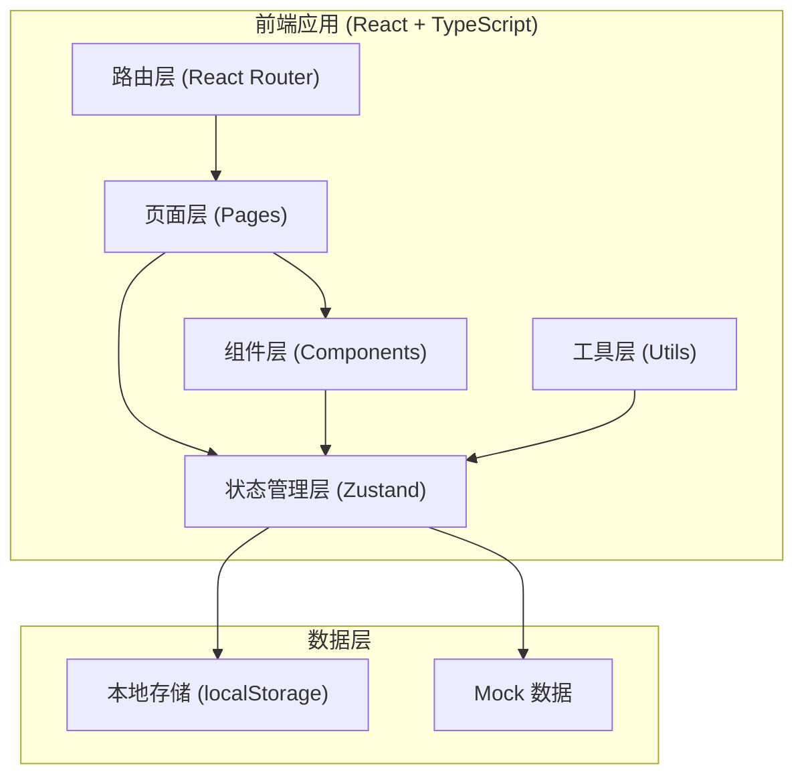
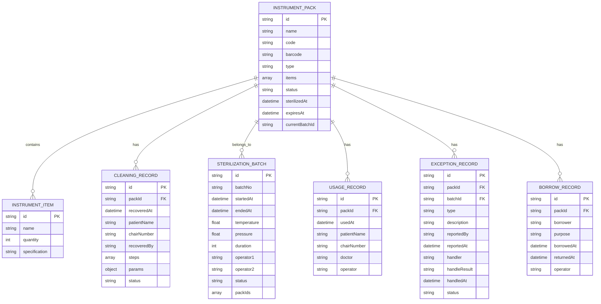

## 1. 架构设计

## 2. 技术说明

- **前端框架**: React 18 + TypeScript
- **构建工具**: Vite 5
- **路由管理**: react-router-dom 6
- **状态管理**: zustand
- **样式方案**: Tailwind CSS 3
- **图标库**: lucide-react
- **数据持久化**: localStorage
- **初始化方式**: vite-init (react-ts 模板)

## 3. 路由定义

| 路由 | 页面 | 说明 |
|------|------|------|
| /instruments | 器械包台账 | 器械包列表、新增/编辑、状态统计 |
| /cleaning | 清洗消毒登记 | 回收登记、清洗步骤、参数录入 |
| /sterilization | 灭菌放行 | 灭菌批次、放行确认、有效期管理 |
| /exceptions | 异常处理 | 异常上报、处理记录、批次追溯 |
| /inventory | 库存与借还 | 库存总览、借还登记、开包使用 |
| /trace | 追溯查询 | 四维查询入口、链路展示 |

## 4. 数据模型

### 4.1 数据模型定义

### 4.2 数据状态枚举

- **器械包状态 (status)**:
  - `in_use` - 在用/使用中
  - `cleaning` - 清洗中
  - `sterilizing` - 灭菌中
  - `sterilized` - 已灭菌（无菌库存）
  - `expired` - 已过期
  - `exception` - 异常
  - `borrowed` - 已借出

- **清洗记录状态**:
  - `pending` - 待清洗
  - `cleaning` - 清洗中
  - `completed` - 已完成
  - `failed` - 不合格

- **灭菌批次状态**:
  - `pending` - 待灭菌
  - `sterilizing` - 灭菌中
  - `completed` - 已完成
  - `released` - 已放行
  - `failed` - 不合格

- **异常类型**:
  - `missing` - 缺件
  - `damaged` - 破损
  - `unqualified` - 不合格
  - `other` - 其他

## 5. 状态管理设计

使用 zustand 管理全局状态，按模块拆分：

- **useInstrumentStore**: 器械包数据管理
- **useCleaningStore**: 清洗消毒记录管理
- **useSterilizationStore**: 灭菌批次管理
- **useExceptionStore**: 异常记录管理
- **useInventoryStore**: 库存与借还管理
- **useTraceStore**: 追溯查询管理

## 6. 组件规划

### 6.1 通用组件
- `Layout` - 整体布局（侧边导航 + 内容区）
- `Sidebar` - 侧边导航栏
- `StatusBadge` - 状态标签
- `StatCard` - 统计卡片
- `Modal` - 弹窗组件
- `Button` - 按钮组件
- `Input` - 输入框组件
- `Table` - 表格组件

### 6.2 业务组件
- `InstrumentForm` - 器械包表单
- `CleaningSteps` - 清洗步骤组件
- `SterilizationBatchCard` - 灭菌批次卡片
- `TraceTimeline` - 追溯时间线
- `InventoryCard` - 库存卡片
- `ExceptionTimeline` - 异常时间线

## 7. 工具函数

- `dateUtils` - 日期时间格式化、有效期计算
- `barcodeUtils` - 条码生成、校验
- `storageUtils` - localStorage 操作封装
- `traceUtils` - 追溯链路构建
